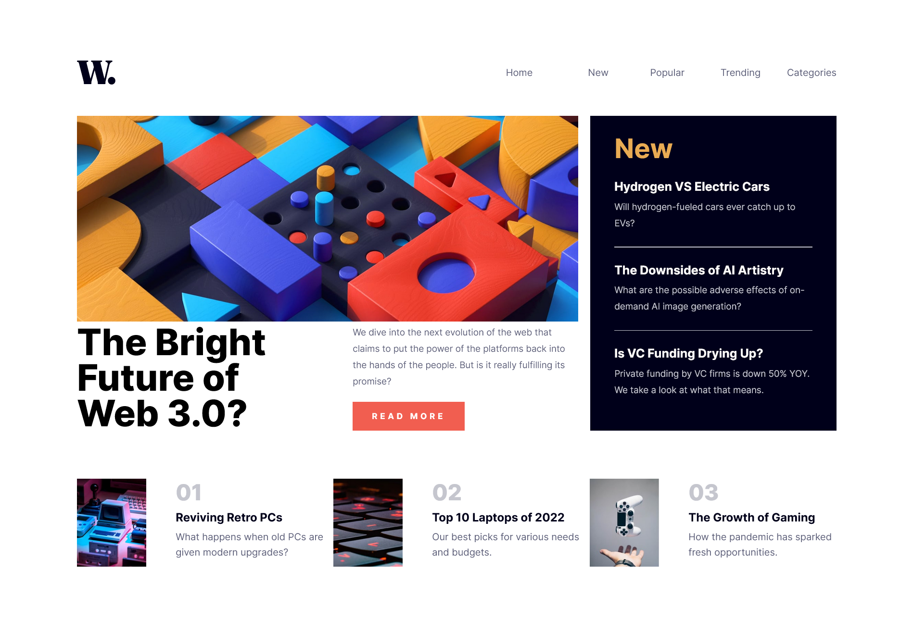

# Frontend Mentor - News homepage solution

This is a solution to the [News homepage challenge on Frontend Mentor](https://www.frontendmentor.io/challenges/news-homepage-H6SWTa1MFl). Frontend Mentor challenges help you improve your coding skills by building realistic projects. 

## Table of contents

- [Overview](#overview)
  - [The challenge](#the-challenge)
  - [Screenshot](#screenshot)
  - [Links](#links)
- [My process](#my-process)
  - [Built with](#built-with)
  - [What I learned](#what-i-learned)
  - [Continued development](#continued-development)

**Note: Delete this note and update the table of contents based on what sections you keep.**

## Overview

### The challenge

Users should be able to:

- View the optimal layout for the interface depending on their device's screen size
- See hover and focus states for all interactive elements on the page

### Screenshot



### Links
- Live Site URL: [https://technewsappbyade.netlify.app]

### Built with

- Semantic HTML5 markup
- CSS custom properties
- CSS Grid only (no Flexbox)
- Vanilla JavaScript

### What I learned

The only new thing I learnt is that it's possible to re-order grid systems using the CSS `order` property and assigning it a keyword that specifies the so called order. For example...
```css
.grid-element1{
  order: 2;
}
.grid-element2{
  order: 1
}
```
Google and read more on CSS order property for more info.

**Note: Delete this note and the content within this section and replace with your own learnings.**

### Continued development

I want to learn how to build these kind of things with tools like Vue and React.